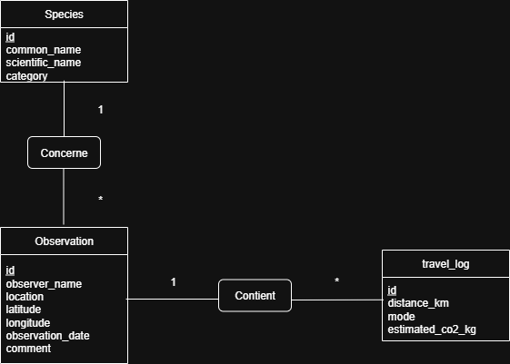

# Application Environement

## Présentation
L’application **Environement** est **API REST Java** permettant de signaler et de visualiser des observations d’espèces (animales, végétales...) dans la nature.  
Elle repose sur une architecture **Spring Boot**, **JPA/Hibernate** pour la persistance, et **MySQL** comme base de données relationnelle.

Les principales fonctionnalités sont :  
- Création et consultation des **espèces** (*Species*).  
- Création et consultation des **observations** (*Observations*).  
- Création et consultation des **déplacements** (*Travellogs*).  
- Gestion des relations entre entités (une observation est liée à une espèce et à plusieurs travellogs).  
- Documentation de l’API via **Swagger**.  
- Utilisation de **DTOs** pour la récupération et l’exposition des données.

---

## Technologies utilisées
- **Java 22**  
- **Spring Boot** (Spring Web, Spring Data JPA)  
- **Maven** (gestionnaire de dépendances et de build)  
- **MySQL** (base de données)  
- **Swagger / OpenAPI** (documentation de l’API REST)
- **Lombok** (facilitation de la création de getters, setters, constructeurs des entités) 

---

## Modèle de données
Le modèle repose sur trois entités principales :  

- **Specie :**  
  * id : Long
  * commonName : String
  * scientificName : String
  * category : Category (enum)

- **Observation :**  
  * id : Long
  * specie : Specie
  * observerName : String
  * location : String
  * latitude / longitude : Double
  * observationDate : LocalDate
  * comment : String (optionnel)

- **Travellog :**  
  * id : Long
  * observation : Observation
  * distanceKm : Double
  * mode : TravelMode (enum)
  * estimatedCo2Kg : Double 

### Relations principales
- `Specie (1) ⟶ (N) Observation`  
- `Observation (1) ⟶ (N) Travellog`

### Enumérations
- **Catégories d'espèces :**
  - BIRD *(oiseau)*
  - MAMMAL *(mammifère)*
  - INSECT *(insecte)*
  - PLANT *(plante)*
  - OTHER *(autre)*

- **Modes de transport :**
  - WALKING *(à pied)*
  - BIKE *(vélo)*
  - CAR *(voiture)*
  - BUS *(bus)*
  - TRAIN *(train)*
  - PLANE *(avion)*

---

## Prérequis
- Java 22 installé et configuré.  
- Maven installé.
- MySQL en fonctionnement (les informations de connexion sont à compléter dans `application.properties`).  

---

## Installation et lancement
1. **Cloner le projet** :  
   ```bash
   git clone https://github.com/Morgan-B3/ECF_05_AOUT_2025.git
   cd Environement

2. **Lancer le projet** :
   ```bash
   mvn spring-boot:run

3. **Utilisation :**

    - Une fois l'application lancée, les différents endpoints sont disponibles via Swagger à l'URL suivante : http://localhost:8080/swagger-ui/index.html#

## Modélisation des données

La conception de l'application a été réalisée en suivant les diagrammes suivants (également présents à la racine du projet) :

- **Modèle logique de données :**
  


- **Diagramme de classes :**
  


---

## Exemples de endpoints

##### Espèces

* `POST /species` → Ajouter une espèce
* `GET /species` → Liste des espèces connues
* `GET /species/{id}` → Détails d’une espèce

##### Observations

* `POST /observations` → Ajouter une observation
* `GET /observations?pageSize=10&pageNumber=0` → Toutes les observations (avec option de filtre d'affichage)
* `GET /observations/{id}` → Voir une observation
* `GET /observations/by-location?location=Paris` → Filtrer par lieu
* `GET /observations/by-species/{speciesId}` → Filtrer par espèce

##### Déplacements
* `POST /travel-logs` → Créer un déplacement lié à une observation
* `GET /travel-logs` → Liste des déplacements + émissions totales CO₂.
* `GET /travel-logs/stats/{idObservation}` → Liste les statistiques liées à un déplacement (émission totale et individuelle de chaque transport)
* `GET /travel-logs/user/{name}` → Liste les déplacements du mois dernier pour un utilisateur donné
